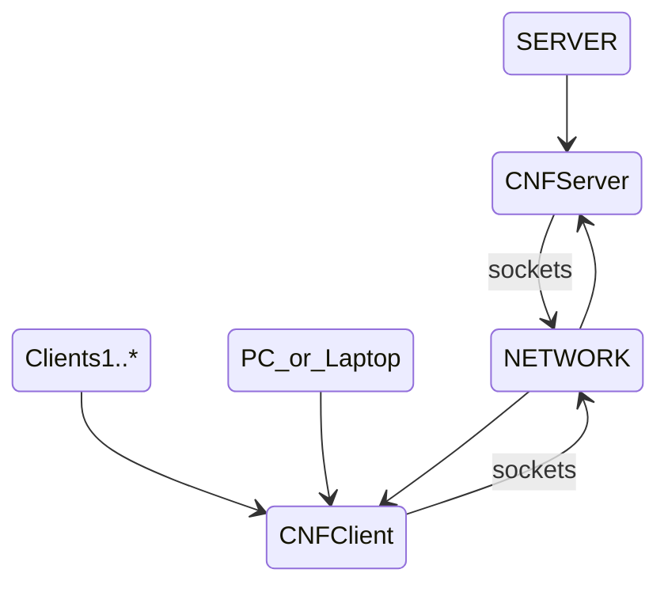
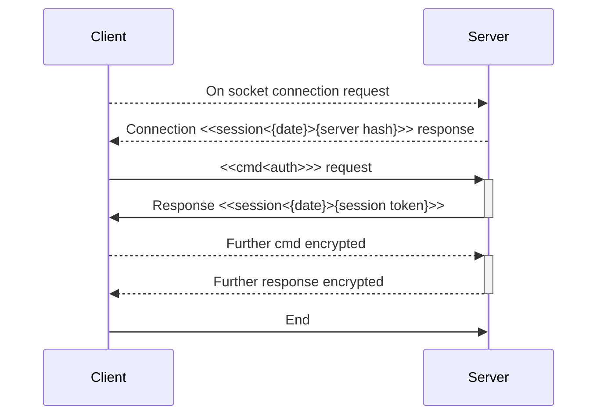

# Server Configuration Central

This is a network based application project.
That provides an perl based centralized CNF configuration solution.

The current version is  **1.0** and is in the **Moon** stage of the development process, so it is early days.

## The Concept

---

* The CNFServer instance runs on the server, to provide multiple clients access to the same CNF application configuration.
  * CNFServer manages multiple connections and perform its own container based access and possible client interaction.
* Provide direct socket connection between devices, bypassing any other external tools requirements or libraries.
* Using an CNFClient to access this configuration instead of an local file, can have many benefits.
  * General and common settings are managed from one location, not having to update across the whole network.
    * i.e. Database settings and particulars for the network.
    * PerlCNF itself is an design concept where default configuration is delivered with default settings.

        That the application latter transfers to another alternative store if modified during use, or after application update.
  * Security and access to network application settings is not locally managed or visible.
  * The configuration needed by some application is not loaded and initiated locally but coming fast from the network.
  * Spex's are server side obtained or run.
    * A SPEX is an server side secure executed perl program output.
    * Useful again if an networking application can be run and maintained from one computer. And not having to install it on other computers.
  * It is implemented in the perl language. To less obscure implementation and to easier troubleshoot on a higher level. Without going into complex levels and hierarchical structures while still is test driven development. Low level modules come from established and in use/invented CPAN modules.
    * Smaller the perl source code the faster and easier it is to be maintained.

## Protocols

Protocol is inbuilt part of the system and channel. Not based on any standards.
It doesn't require or goes through any additional network or system layers.

* Protocol between Client and Server are here specified.
  
  * Connection request and response is for server sending an time stamp.
  * General plain interaction is ,client sends command, and server responds, not depending on termination.
  * Authentication protocol required commands, client has to request. As this deeper dives into more clearer communication and control.
  * Authenticating commands is not much for security, but to follow exact and required steps.
  * This protocol from start in specs, is to be capable to run on any network. 
    * But attention is not at all for the internet.

### Authentication Protocol

* The Server generates on first run a server signature unique hash code if not found.
  * Client receives this token during connection stage.
    * The hash is used for authentication request part.
  * The client next sends an **auth** request to server.
  * Server authenticates and sends either error or an session token.
  * Both the hash code and the session tokens are further on used.
    * To perform further socket session encryption I/O during communication, if required.
    * Each Server has its own port and hash, and each client has its own session, to any one server.
    * Usual setup on a local network is one server for the whole any number of clients.
    * Datagrams of others can't read or process as their are scrambled on the network.
    * Server can process and even store, network issued variable.
      * This explanation for and about these, will be available at some later stage on this page.
    * Server can also deliver various formats and parts of data, files, from third party services as an central.

## Perl CNF

* **Perl based Configuration Network File Format Parser.**
  * Provides a user friendly, property value pair processing, easy configuration and processing under special specifications.  
  * It is geared towards the Perl language semantics and its ultra fast hash organizing.

For further info and details, please visit [PerlCNF Project](https://github.com/wbudic/PerlCNF/blob/master/README.md).

## SPEX

**S**erver **P**erl **Ex**ecuted program.

* Provides extension mechanism, that enables future little programs to run.
On an existing server, that deosn't not require server code to be changed.
* It has to be limited on what can execute in an sandbox from the server and system.
* It activates from an embedded CNF property, in any config file.
  * The config files are usually located in a local **./configs** directory.

## Installation

**Info is not available yet.**

## Software Release Stages

Following are mine software development release stages.
As paradigm invented and adopted by me the author here.
I stand to be corrected, and all next mentioned is from my own experience and practice.

**Will Budić**

* A Software Project goes through an life cycle of stages, each having its merit and also flexibility of usability.
  * Each stage can take any amount of time, but must keep compatibility and nature as software is being used.
    * New stage entered, therefore must be compatible with the data, format and usability of the previous stage.
    * From old stage to new, format and data, must be migrated and capable for access and valid.
      At least at the moment from upgrade to continued now new functionality and features.
    * Moving to an advanced stage, that is drastically different and not compatible with an previous stage is not possible.
      * If this is the case, a new PROJECT is rather made. And current one is stuck in the current stage.
* Each stage can have many releases, but not different or own versioning. It is progressive in time, and releases are numbered to an higher number from the previous one. Which is how it this expected.
* New and current development is done on a branch of the last main stable release.
  * When a new Release, fully ready and stable, It is merged to the main branch.
  * After testing the main branch and final good. A new release is tagged on the main branch.
    * Then and new branch made, for the current possible further development.

### There are three stages to an software project.

* **Moon Stage**

  * This is the initial stage, also the experimental one.
  * First concepts and plans are established, fun stage, as brings new ones to light.
  * Like the moon goes through stages great satellite it is, it can as our shield take blows. Go through numerous phases and tribulations.
  * In this stage the project not only grows. But also bonds us to it, to make usable and become implementation to be adopted.
  * It becomes an release, when it is ready to enter as project the next stage.
  * As release it prepares for the next stage. All faults or new features now enter.
  * When long enough in use as such it is ready to progress to the next stage.

* **Sun Stage**

  * This is the finalization for total use and the total with scruples stage.
  * Previous concepts are now established in this stage, and all existing features can be only enhanced.
  * Like the Sun, all ideas and code is put into the light of the Sun, the goal is to squash anything not appropriate.
  * In this stage usually the project is re-developed, existing and started data is taken in account.
  * Code is boomed up, bettered and made useful and more user friendly, tested and all concepts are final.
  * On release, this stage, starts of gearing the Project towards the next stage, very complex one.
  

* **Earth Stage**

  * This is the final stage, release is fully ready for planet Earth.
  * Has your program thought about, where the data is stored.
  * Where and what system uses it, how will different users react?
  * Will it be abused, smacked around to not only be functional, but not compatible.
  * Like the earth, this is a stage, of no return it is released to full human use.
  * To enter this stage, the project has final plans, tests, features and working usability.
  * On release, the project can only be further worked on, to be enhance on existing, or fix uncomprenhisble situations,
   or missed and not foreseeing tidbits. As it had hit the general use on earth.

