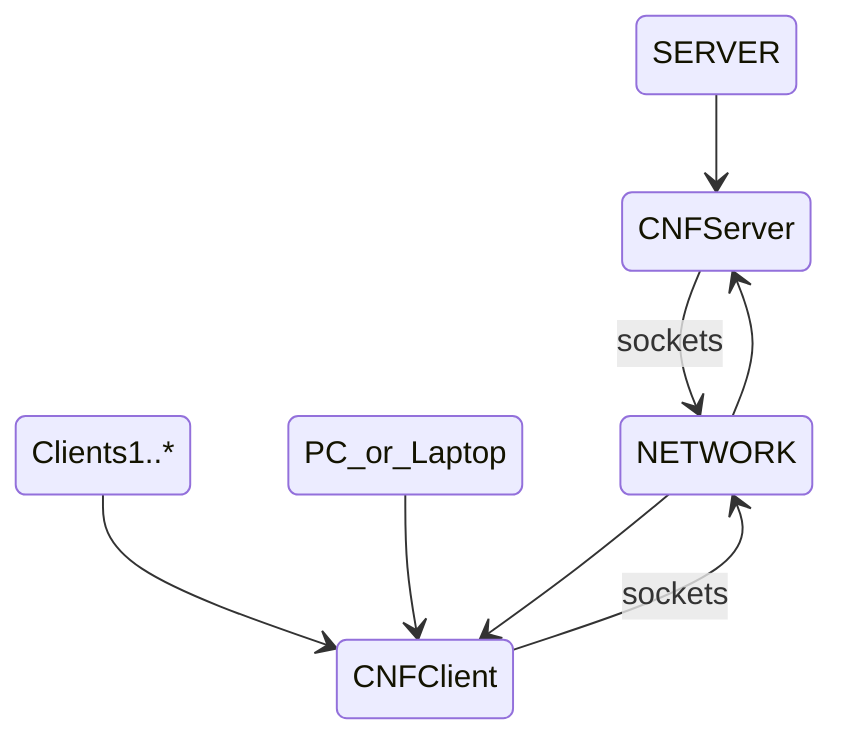

# Server Configuration Central

This is a network based application project.
That provides an perl based centralized CNF configuration solution.

The current version is  **1.0** and is in the **Moon** stage of the development process, so it is early days.

## The Concept

* The CNFServer instance runs on the server, to provide multiple clients access to the same CNF application configuration.
  * CNFServer manages multiple connections and perform its own container based access and possible client interaction.
* Provide direct socket connection between devices, bypassing any other external tools requirements or libraries.
* Using an CNFClient to access this configuration instead of an local file, can have many benefits.
  * General and common settings are managed from one location, not having to update across the whole network.
    * i.e. Database settings and particulars for the network.
    * PerlCNF itself is an design concept where default configuration is delivered with default settings. 

        That the application latter transfers to another alternative store if modified during use, or after application update.
  * Security and access to network application settings is not locally managed or visible.    
  * The configuration needed by some application is not loaded and initiated locally but coming fast from the network.
  * Spex's are server side obtained or run.
    * A SPEX is an server side secure executed perl program output.
    * Useful again if an networking application can be run and maintained from one computer. And not having to install it on other computers.

## Perl CNF

* **Perl based Configuration Network File Format Parser.**
  * Provides a user friendly, property value pair processing, easy configuration and processing under special specifications.  
  * It is geared towards the Perl language semantics and its ultra fast hash organizing.

For further info and details, please visit [PerlCNF Project](https://github.com/wbudic/PerlCNF/blob/master/README.md).

## Installation

  Info is not available yet.
