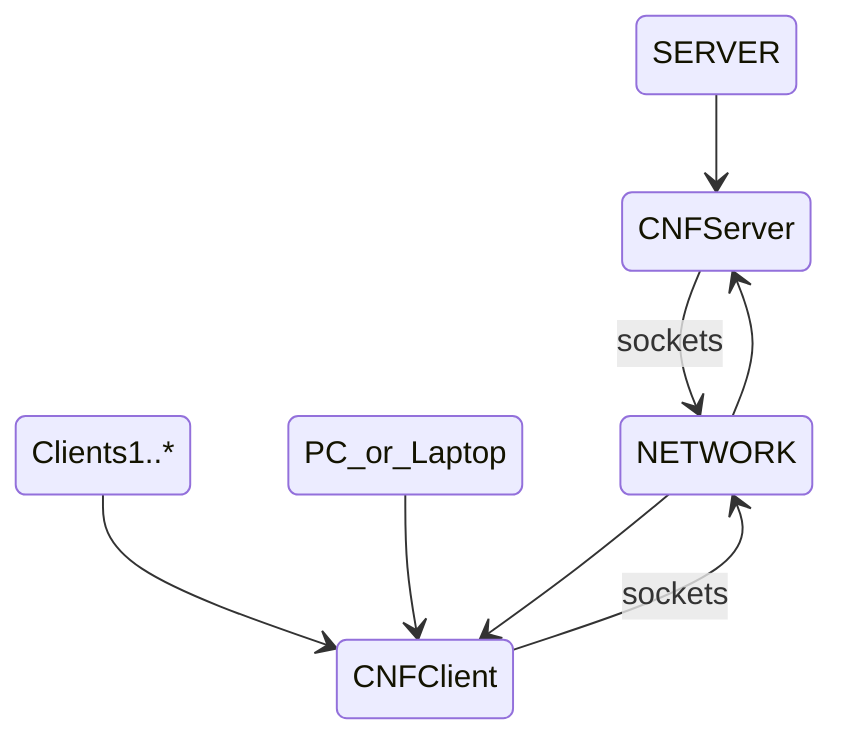
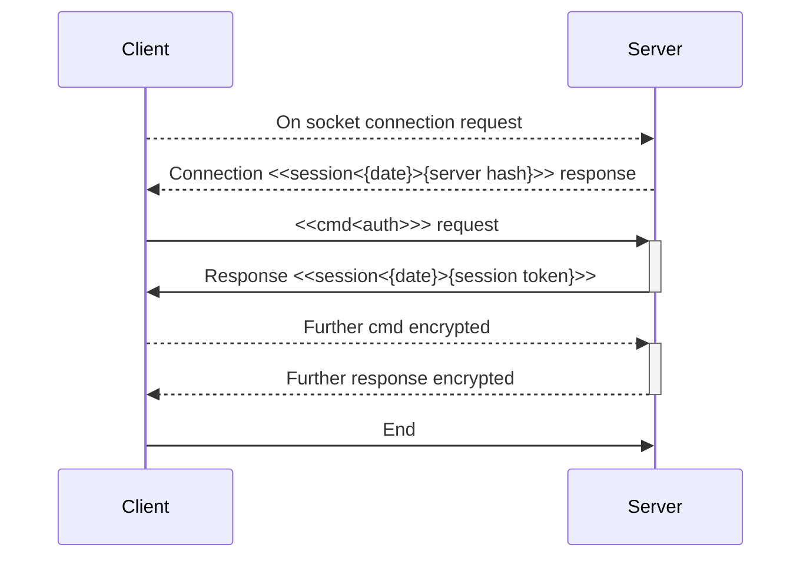

# Server Configuration Central

This is a network based application project.
That provides an perl based centralized CNF configuration solution.

The current version is  **1.0** and is in the **Moon** stage of the development process, so it is early days.

## The Concept

---

* The CNFServer instance runs on the server, to provide multiple clients access to the same CNF application configuration.
  * CNFServer manages multiple connections and perform its own container based access and possible client interaction.
* Provide direct socket connection between devices, bypassing any other external tools requirements or libraries.
* Using an CNFClient to access this configuration instead of an local file, can have many benefits.
  * General and common settings are managed from one location, not having to update across the whole network.
    * i.e. Database settings and particulars for the network.
    * PerlCNF itself is an design concept where default configuration is delivered with default settings. 

        That the application latter transfers to another alternative store if modified during use, or after application update.
  * Security and access to network application settings is not locally managed or visible.    
  * The configuration needed by some application is not loaded and initiated locally but coming fast from the network.
  * Spex's are server side obtained or run.
    * A SPEX is an server side secure executed perl program output.
    * Useful again if an networking application can be run and maintained from one computer. And not having to install it on other computers.

## Protocols

---

Protocol is inbuilt part of the system and channel. Not based on any standards.
It doesn't require or goes through any additional network or system layers.

* Protocol between Client and Server are here specified.
  
  * Connection request and response is server sending an stamp.
  * General plain interaction is client sends command, and server response and termination.
  * Authentication protocol required commands.

---

### Authentication Protocol

---

* The Server generates on first run an server signature unique hash code if not found.
  * Client receives this token during connection stage.
    * The hash is used for authentication request part.
  * The client next ends an **auth** request to server.
  * Server authenticates and send either error or the session token.
  * Both the hash code and the session tokens are further on used. 
    * To perform further socket session encryption I/O during communication.
    * Each Server has its own port and hash, and each client has its own session.
    * Datagrams of others can't read or process as their are scrambled on the network.

## Perl CNF

---

* **Perl based Configuration Network File Format Parser.**
  * Provides a user friendly, property value pair processing, easy configuration and processing under special specifications.  
  * It is geared towards the Perl language semantics and its ultra fast hash organizing.

For further info and details, please visit [PerlCNF Project](https://github.com/wbudic/PerlCNF/blob/master/README.md).

---

## SPEX

---

**S**erver **P**erl **Ex**ecuted program. 

* Provides extension mechanism, that enables future little programs to run.
On an existing server, that deosn't not require server code to be changed.
* It has to be limited on what can execute in an sandbox from the server and system.
* It activates from an embedded CNF property, in any config file.
  * The config files are usually located in a local **./configs** directory.

## Installation

---

  Info is not available yet.
